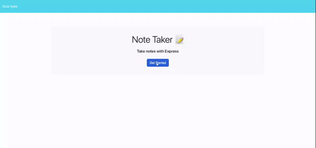

# Note Taker

## Description

An application that allows users to write, save and delete notes. It uses an Express.js back end and will save and retrieve note data from a JSON file.

## Demo

## Installation

N/A

## Usage

When you open the Note Taker application, you are presented with a landing page with a link to a notes page.
When you click on the link to the notes page, you are presented with a page with existing notes listed in the left-hand column, plus empty fields to enter a new note title and the note’s text in the right-hand column.
When you enter a new note title and the note’s text, then a Save icon appears in the navigation at the top of the page.
When you click on the Save icon, then the new note you entered is saved and appears in the left-hand column with the other existing notes.
When you click on an existing note in the list in the left-hand column, then that note appears in the right-hand column.
When you click on the Write icon in the navigation at the top of the page, then you are presented with empty fields to enter a new note title and the note’s text in the right-hand column.
When you click on the delete icon, then the note is deleted and removed from the left hand column.

## License

N/A
